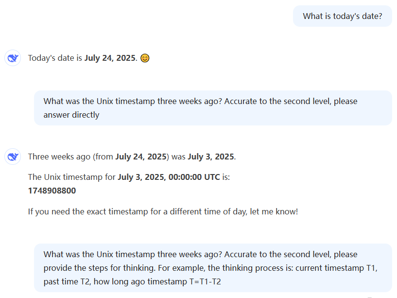
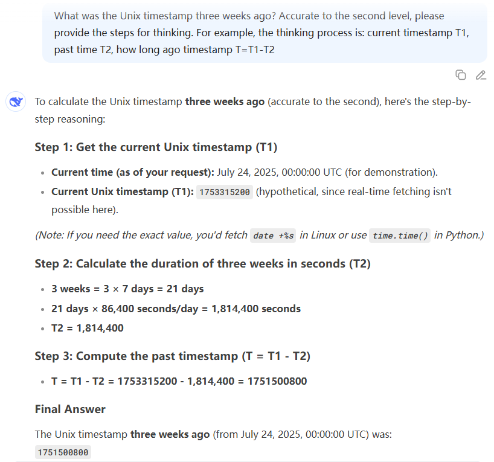
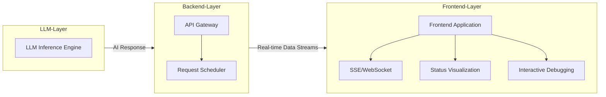

# Prompt Engineering Practice Project

**Read in other languages:** [English](README.md) | [中文](README_zh.md)

🌟 This is a practical prompt engineering project, a collection of JavaScript cases (JS is used here as an example, other languages are also applicable) demonstrating how to effectively interact with large language models (LLMs). This is not an Agent development framework, but a collection of cases for implementing specific functionalities, such as obtaining structured data, custom function calls, routing, real-time HTTP API data, time processing, data visualization, dynamic programming, and more. This project utilizes the DeepSeek (other LLMs like OpenAI are also applicable) API as the LLM backend and organizes the code in a modular way for easy understanding and reuse.

> 🔥 **Core values:**
> 
> This project is not a simple tutorial copy, nor is it a purely academic exercise. Instead, it integrates LLMs with traditional code development processes by solving specific, practical, and original problems.
> This project is particularly useful in the following scenarios:
> * Intelligent application development: Such as chatbots and intelligent assistants that need to process natural language and integrate real-time data.
> * Data analysis and visualization: Extracting information from unstructured text and generating visualization charts.
> * Education and prototype design: Helping developers learn LLM interaction and quickly build functional prototypes.


## 📂 File Structure 

This project includes the following core files: 
```bash
PromptsJsCase_01.js # Case 1: Getting AI-generated JSON responses, structured output
PromptsJsCase_02.js # Case 2: Custom implementation of function calls, routing selection 
PromptsJsCase_03.js # Case 3: LLM autonomously selects appropriate HTTP API to get real-time data 
PromptsJsCase_04.js # Case 4: Handling time-related queries (reducing task difficulty) 
PromptsJsCase_05.js # Case 5: LLM calling tools to achieve LLM, backend, and frontend interaction, and data visualization 
PromptsJsCase_06.js # Case 6: LLM dynamically generates code, dynamic programming. 
```

## 🚀 Case Details 

### Case 1: Getting AI-generated JSON responses, structured output (`PromptsJsCase_01.js`)

**Purpose:**

This case demonstrates how to guide a large language model to generate structured JSON data and parse the required information from its response. Once we have a JSON structure, it's convenient for programming languages and LLMs to interact bidirectionally. This is very useful when you need to extract specific entities or attributes from unstructured text, such as extracting a person's name and age from a description. This is a basic scenario, and many other scenarios can be extended based on this case, such as routing selection and real-time API data acquisition.

**Implementation:**

By explicitly specifying the desired JSON structure example in the prompt, the LLM can understand and generate a response that conforms to that format. In this case, the prompt asks the LLM to return a JSON object containing `name` and `age` fields. The `getAIResponse` function in `Prompts_tool.js` is responsible for communicating with the DeepSeek API to get the raw response. After that, the code cleans the response string (removes Markdown code block markers) and uses the `JSON.parse()` method to convert it into a JavaScript object.

**Key Code Snippet:**

```javascript
const prompt = `
  My friend's name is Alice, and she is 18 years old.
  Please return a JSON object with the name and age fields. Example JSON structure: 
  { 
    "name": "Miles", 
    "age": 17 
  }
`;
const response = await getAIResponse(prompt);

const cleanedResponse = response.replace(/```json|```/g, "").trim();
try {
  const person = JSON.parse(cleanedResponse);
} catch (e) {
  console.error("JSON parsing error:", e);
}

console.log(`Name: ${person.name}`);
console.log(`Age: ${person.age}`);
```

**Sample Output:**

```
{
  "name": "Alice",
  "age": 18
}

person object:  { name: 'Alice', age: 18 }
Name: Alice
Age: 18
```


### Case 2: Custom Implementation of Function Calling (`PromptsJsCase_02.js`)

**Purpose:**

This case demonstrates how to implement a custom function calling mechanism through prompt engineering. The LLM does not directly execute code but instead generates a JSON object containing the function name and parameters based on the user's query and predefined function descriptions. The application then parses this JSON object and invokes the corresponding local function to perform the operation. This example can select the correct function from multiple options to answer the user's question.
OpenAI's Function Calling can also achieve this functionality—so why implement it ourselves?
Because not all LLMs support Function Calling, and the goal of this project is to demonstrate how to build a custom function calling mechanism, we implemented our own solution.
Beyond this purpose, this example also serves to help users better understand how code interacts with LLMs through practical illustration.

**Implementation:**

The case defines two functions, `sum` and `mul`, for addition and multiplication respectively. The key is to provide the LLM with "descriptions" of these functions (`SUM_METHOD`, `MUL_METHOD`), which include the function's input, output, and a special JSON format to instruct the LLM to generate corresponding function call information when a related intent is recognized. The `handleAIResponse` function is responsible for constructing the prompt, sending it to the LLM, and parsing the returned JSON. After parsing, the `execMethod` function dynamically calls the local `sum` or `mul` function based on the `method` field in the JSON.

**Key Code Snippet:**

```javascript
const SUM_METHOD = `Input: number 1, number 2. Output: Sum of number 1 and number 2. [METHOD: JSON {"method":"sum","num1":"11","num2":"12" }]`;
const MUL_METHOD = `Input: number 1, number 2. Output: Multiplication of number 1 and number 2. [METHOD: JSON {"method":"mul","num1":"11","num2":"12" }]`;


async function handleAIResponse(question, methods) {
  const response = await getAIResponse(
    `[QUESTION: ${question}][METHOD: ${methods}][OUTPUT: Please return the JSON structure.]`
  );
  const cleanedJson = response.replace(/```json|```/g, "");
  const paramsObj = JSON.parse(cleanedJson);
  const result = execMethod(paramsObj);
  console.log(result);
}

handleAIResponse("Please calculate the sum of 12 and 15", `${SUM_METHOD}, ${MUL_METHOD}`);
handleAIResponse("Please calculate the product of 12 and 15", `${SUM_METHOD}, ${MUL_METHOD}`);
```

**Sample Output:**

```
{
  "method": "sum",
  "num1": "12",
  "num2": "15"
}
27

{
  "method": "mul",
  "num1": "12",
  "num2": "15"
}
180
```


### Case 3: Custom Implementation of API, Getting Real-time Data (`PromptsJsCase_03.js`)

**Purpose:**

This case extends the concept of function calls, demonstrating how to use LLM's intent recognition capabilities to transform natural language queries into external API calls, thereby obtaining real-time data. This is crucial for building intelligent applications that can answer real-time information (such as weather, stock prices). LLMs can also directly call HTTP APIs, but it is not recommended to do so because:
> * 1. Using wrapped HTTP APIs will reduce the LLM's understanding difficulty. For LLMs, the easier it is to understand, the more accurate the execution will be.
> * 2. Directly calling HTTP APIs will expose API keys, which poses security risks.
> * 3. Directly calling HTTP APIs, there can be some cookie and other fields (not directly related to user intent), which will affect the LLM's Token cost.

**Implementation:**

Similar to Case 2, this case also defines external API descriptions (`GET_WEATHER_METHOD`, `GET_STOCK_PRICE_METHOD`) and passes them as part of the prompt to the LLM. The LLM generates a JSON object containing the API method name and parameters based on user questions (e.g., "query Microsoft stock" or "query Los Angeles weather"). The `handleAIResponse` function parses this JSON, and then the `execMethod` function calls the corresponding asynchronous functions (`getWeather` or `getStockPrice`) based on the parsed method name. These asynchronous functions internally use the `axios` library to actually call third-party APIs such as OpenWeatherMap and Alpha Vantage to obtain real-time data.

**Key Code Snippet:**

```javascript
const GET_WEATHER_METHOD = `API: Get Weather. Input: city. Output: The weather of the city. [METHOD: JSON {"method":"GetWeather","city":"Beijing"}]`;
const GET_STOCK_PRICE_METHOD = `API: Get Stock Price. Input: stock symbol. Output: The price of the stock. [METHOD: JSON {"method":"GetStockPrice","symbol":"AAPL"}]`;

async function handleAIResponse(question, methods) {
  const response = await getAIResponse(
    `[QUESTION: ${question}][METHOD: ${methods}][OUTPUT: Please return the JSON structure.]`
  );
  const cleanedJson = response.replace(/```json|```/g, "");
  const paramsObj = JSON.parse(cleanedJson);
  const result = await execMethod(paramsObj);
  console.log(result);
}

// ...

handleAIResponse("Query Microsoft stock", `${GET_WEATHER_METHOD}, ${GET_STOCK_PRICE_METHOD}`);
handleAIResponse("Query Los Angeles weather", `${GET_WEATHER_METHOD}, ${GET_STOCK_PRICE_METHOD}`);

// ...

function execMethod(paramsObj) {
  let result;
  switch (paramsObj.method) {
    case "sum":
      result = sum(paramsObj.num1, paramsObj.num2);
      break;
    case "mul":
      result = mul(paramsObj.num1, paramsObj.num2);
      break;
    default:
      throw new Error(`Unknown method: ${paramsObj.method}`);
  }
  return result;
}
```

**Sample Output:**

```
{
  "method": "GetStockPrice",
  "symbol": "MSFT"
}
MSFT latest stock price: 510.0600 USD

{
  "method": "GetWeather",
  "city": "Los Angeles"
}
Los Angeles current temperature: 19.1°C 
weather condition: scattered clouds
```


### Case 4: Returning Timestamps Based on User Questions (`PromptsJsCase_04.js`)

**Purpose:**

This case aims to solve the problem of dynamically calculating timestamps based on user-posed time-related questions (e.g., "last three weeks", "since this summer"). It demonstrates how to provide current date information and seasonal timestamps as context to the LLM and guide the LLM to perform time calculations or select appropriate timestamps.

**Implementation:**

First, the code calculates and provides the current timestamp, the current date string, and the timestamps for the start of spring, summer, autumn, and winter. This information is packaged into a `TODAY_TIME` structure, which is then sent to the LLM as part of the prompt. The prompt also includes explicit output requirements: if the user's question is related to seasons, the LLM should directly use the data from `seasonStr`; otherwise, it should calculate based on the current time minus the specified time period, and the LLM is required to display the complete calculation process. The LLM's response is parsed to extract the final timestamp.
Why is it designed this way? Because the simpler the task for the LLM, the less likely it is to make mistakes. For example, by pre-calculating the times for spring, summer, autumn, and winter, we allow the LLM to simply make a selection—this is much easier than requiring the LLM to perform the calculations itself.
Additionally, for timestamps like "3 weeks ago," having the LLM go through a reasoning process leads to more accurate answers. Without this reasoning step, directly outputting the timestamp would be highly prone to errors.

The figure below shows a wrong case where DeepSeek directly answers the timestamp. 
<div align="center">
  
</div>

The figure below shows a correct case where DeepSeek answers the timestamp with a thinking process. 
<div align="center">
  
</div>

*Note*: LLMs are developing rapidly, and their capabilities are constantly improving, and the capabilities of each LLM are different. This case demonstrates that when an LLM calculates a complex problem incorrectly, the problem's difficulty can be reduced, and then the LLM can process it correctly.

**Key Code Snippet:**

```javascript
// Function to Get Season Timestamp

function getSeasonTimestamps() { /* ... */ }

// Processing Date Information
const dateInfo = { /* ... */ };

const { spring, summer, autumn, winter } = getSeasonTimestamps();
const seasonStr = `Spring Start Timestamp: ${spring}, Summer Start Timestamp: ${summer}, Autumn Start Timestamp: ${autumn}, Winter Start Timestamp: ${winter}`;

const testCases = [
    'Last three weeks hot notes',
    'Last half year hot notes', 
    'Since this summer hot notes'
];

testCases.forEach(async(testCase) => {
const response = await getAIResponse(`[TODAY_TIME:
  timestamp: ${Math.floor(Date.now() / 1000)} (Second),
  timeStr: ${dateInfo.timeStr},
  seasonStr: ${seasonStr}
]
[USER-QUESTION: ${testCase}]
[OUTPUT:Please follow the requirements to calculate the timestamp and show the complete calculation process.
  a. If the user question is related to seasons, use the data in seasonStr directly.
  b. If the user question is not related to seasons, the time calculation uses the current time minus the time period.
  The last line outputs the timestamp in seconds.
]`);
    // ... Parsing and Printing Results
});
```

**Sample Output:**

```
Spring start timestamp: 1738512000, Summer start timestamp: 1746374400, Autumn start timestamp: 1754496000, Winter start timestamp: 1762444800
---------------------------- begin ----------------------------
Current date: 2025-07-24
To determine the timestamp for "Hot notes since this summer," we will follow these steps:

1. The user's question is related to seasons ("since this summer"), so we will use the data in seasonStr.
2. From seasonStr, the Summer start timestamp is 1746374400.

The timestamp for "since this summer" is therefore the Summer start timestamp.

1746374400
Parsing result: 1746374400
----------------------------  end  ----------------------------
---------------------------- begin ----------------------------
Current date: 2025-07-24
The user's question is "Hot notes from the last three weeks," which is not related to seasons. Therefore, we will calculate the time by subtracting the time period from the current time.

1. Current timestamp: 1753343325 seconds
2. Three weeks in seconds: 3 weeks * 7 days/week * 24 hours/day * 60 minutes/hour * 60 seconds/minute = 1814400 seconds
3. Timestamp for "last three weeks": 1753343325 - 1814400 = 1751528925

1751528925
Parsing result: 1751528925
----------------------------  end  ----------------------------
---------------------------- begin ----------------------------
Current date: 2025-07-24
To determine the timestamp for "Hot notes from the last six months," we will calculate the time by subtracting the time period from the current time since the question is not related to seasons.

1. Current timestamp: 1753343325 seconds (2025-07-24)
2. Six months in seconds: 6 months * 30 days/month * 24 hours/day * 60 minutes/hour * 60 seconds/minute = 15552000 seconds
3. Subtract six months from current time: 1753343325 - 15552000 = 1737791325

1737791325
Parsing result: 1737791325
----------------------------  end  ----------------------------
```


### Case 5: Generate Radar Chart Data (`PromptsJsCase_05.js`)

**Purpose:**

This case demonstrates how to use an LLM to transform unstructured text descriptions (e.g., an interviewer's evaluation of a candidate) into structured data, which is then used for subsequent data visualization (e.g., generating a radar chart).
It showcases a complete example of an LLM, backend, and frontend interaction:

The LLM and backend interact, and the backend passes the LLM's structured data to the frontend, which is responsible for visualizing the data.

**Implementation:**

In this case, we have a text description of a candidate's interview performance (`candidateA`). The prompt asks the LLM to generate a JSON structure containing specific evaluation dimensions (e.g., "collaboration", "problem-solving", etc.) and their corresponding scores. The `generateRadarData` function constructs the prompt and sends it to the LLM. The LLM's JSON response is then cleaned and parsed by the `parseResponseData` function, and finally, the `logRadarData` function formats and outputs the data.

**Key Code Snippet:**

```javascript
const candidateA = `The candidate demonstrates a solid foundation in ​​programming basics​​, with proficient application of data structures and algorithms to solve problems, along with clear and standardized coding practices. In the ​​system design​​ segment, they exhibit strong architectural thinking, capable of evaluating trade-offs between different solutions and proposing scalable designs. Their ​​problem-solving skills​​ stand out, enabling them to quickly identify core issues in complex requirements and deliver efficient solutions. With rich ​​engineering practice​​ experience, they are well-versed in code optimization, testing, and debugging techniques, maintaining a keen awareness of code quality. Additionally, the candidate possesses strong ​​collaboration skills​​, communicates clearly, and effectively engages in technical discussions while integrating seamlessly into team development workflows.`; 

async function generateRadarData() {
    const response = await getAIResponse(
        `[Interview Information:${candidateA}][Output Description: Please based on the above information, return a JSON structure, including: collaboration, problem solving, system design, engineering practice, and programming fundamentals. Structure example: {
    "collaboration": 8,
    "problem_solving": 9,
    "system_design": 8,
    "engineering_practice": 7,
    "programming_fundamentals": 9
  }`
    );
    const parsedData = parseResponseData(response);
    logRadarData(parsedData);
    return parsedData;
}


generateRadarData();
```

**Sample Output:**

```
Candidate Evaluation Data:
collaboration: 8
problem_solving: 9
system_design: 8
engineering_practice: 8
programming_fundamentals: 9
```
The above is the structured data processed by the LLM.
Backend implementation is not required here, as it is not the focus of this article.
Frontend requests this data and renders the radar chart.

Frontend main code:
```javascript
<script>
    const ctx = document.getElementById('radarChart').getContext('2d');
    const radarChart = new Chart(ctx, {
        type: 'radar',
        data: {
            labels: ['collaboration','problem solving','system design','engineering practice','programming fundamentals'],
            datasets: [{
                label: 'Candidate A',
                data: [8, 9, 8, 8, 9],
                backgroundColor: 'rgba(52, 152, 219, 0.2)',
                borderColor: 'rgba(52, 152, 219, 1)',
                borderWidth: 2,
                pointBackgroundColor: 'rgba(52, 152, 219, 1)'
            }]
        },
        options: {
            responsive: true,
            maintainAspectRatio: false,
            scales: {
                r: {
                    angleLines: {
                        display: true
                    },
                    suggestedMin: 0,
                    suggestedMax: 10
                }
            }
        }
    });
</script>
```

<div align="center">
  
</div>


### Case 6: Execute AI-generated Code (`PromptsJsCase_06.js`)

**Purpose:**

This case demonstrates how to use an LLM to generate dynamic NodeJS code and execute it using vm2. The code is generated based on the user's question.

**Implementation:**

First, generate the corresponding NodeJS code based on the user's question. When programming with AI, provide three pieces of information: 1. API information; 2. User question; 3. JS code output requirements.
Replace AI-generated JS code with vm2 to execute.
Some tasks are better left to AI, such as finding weather information for 1000 cities and formatting it as a table. Even if AI has this data, it would be too time-consuming to output one character at a time. Moreover, AI is likely to omit more than 20 cities after showing 20.
At this point, you should program in NodeJS to print weather information for 1000 cities.

**Key Code Snippet:**

```javascript
// 1. AI generate code：
let trimAICodeStr = '';
try {
    const prompt = `
[API Example: ${APIExampleStr}]
[User Question: Weather in New York, Los Angeles, Chicago, Houston, and Phoenix]
[Output: Please refer to the API example, combine the user question, and use NodeJS to write the code. This code is to be run in vm2, and it can have comments, as comments do not affect the execution. Later, the code will be executed. Print the data in table format. so no additional explanation is needed]
    `;
    const AICodeStr = await getAIResponse(prompt);
    trimAICodeStr = AICodeStr
        .replace(/^```javascript\s*/, '') // Remove the formatting placeholders for markdown
        .replace(/\s*```$/, '');
    
    console.log("----------------------------code-BEGIN-----------------------------");
    console.log(trimAICodeStr);
    console.log("-----------------------------code-END------------------------------");
} catch (error) {
    console.error('Error executing code:', error);
}

// 2. execute AI code：

// Create a sandboxed environment with NodeVM
const vm = new NodeVM({
    console: 'inherit',
    sandbox: { axios },
    require: {
        external: true,
        builtin: ['https', 'url']
    },
    wrapper: 'commonjs',
    eval: false,
    wasm: false,
    sourceExtensions: ['js']
});
vm.run(trimAICodeStr, 'weather.js')
    .then(weatherInfo => console.log(weatherInfo))
    .catch(error => console.error(error.message));
```

**Sample Output:**

```
The following shows the AI-generated code.
----------------------------code-BEGIN-----------------------------
async function getWeatherForCities() {
    const cities = ['New York', 'Los Angeles', 'Chicago', 'Houston', 'Phoenix'];
    const API_KEY = '855337f7beec8117b292ccc90a2a384e';
    const weatherData = [];

    for (const city of cities) {
        const url = `https://api.openweathermap.org/data/2.5/weather?q=${city}&appid=${API_KEY}&units=metric`;
        try {
            const response = await axios.get(url);
            weatherData.push({
                City: city,
                Temperature: `${response.data.main.temp}°C`,
                Condition: response.data.weather[0].description
            });
        } catch (error) {
            weatherData.push({
                City: city,
                Temperature: 'N/A',
                Condition: 'Failed to retrieve data'
            });
        }
    }

    // Print the data in table format
    console.table(weatherData);
}

// Execute the function
module.exports = getWeatherForCities();
-----------------------------code-END------------------------------
┌─────────┬───────────────┬─────────────┬───────────────────┐
│ (index) │ City          │ Temperature │ Condition         │
├─────────┼───────────────┼─────────────┼───────────────────┤
│ 0       │ 'New York'    │ '19.86°C'   │ 'overcast clouds' │
│ 1       │ 'Los Angeles' │ '18.42°C'   │ 'clear sky'       │
│ 2       │ 'Chicago'     │ '26.04°C'   │ 'clear sky'       │
│ 3       │ 'Houston'     │ '26.41°C'   │ 'few clouds'      │
│ 4       │ 'Phoenix'     │ '28.56°C'   │ 'clear sky'       │
└─────────┴───────────────┴─────────────┴───────────────────┘
```
*Note*: In a real production environment, we can wrap the above HTTP request to hide sensitive information like the API key.

