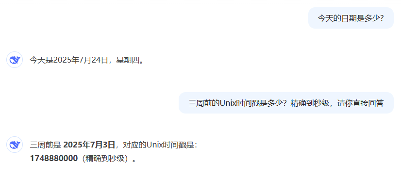
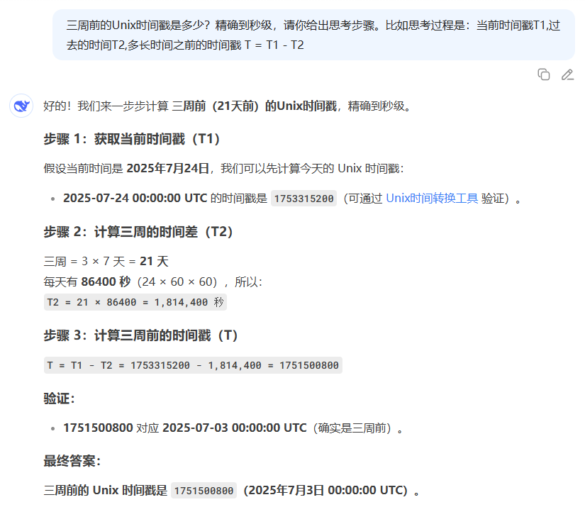
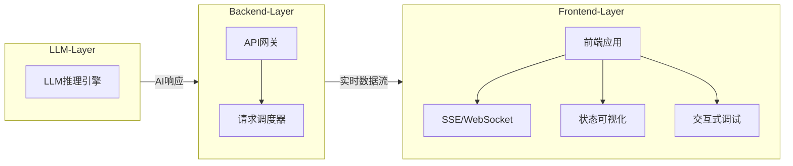
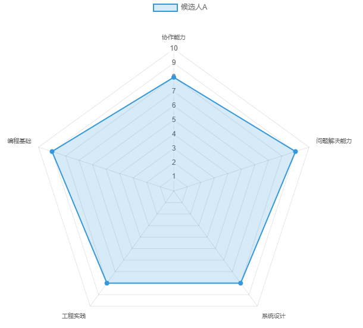

# 提示词工程实践项目

**其他语言版本:** [English](README.md) | [中文](README_zh.md)

🌟 这是一个关于提示词工程的实践项目，一系列 JavaScript（这里只是使用 JS 举例，其他语言也适用） 案例展示如何有效地与大型语言模型（LLM）进行交互 Case 集合。这不是一个 Agent 开发框架，是实现特定的功能 Case 集合，例如获取结构化数据、自定义函数调用、路由选择、实时 HTTP API 数据、处理时间、数据可视化、动态编程等。本项目利用 DeepSeek(OpenAI 等其他 LLM 也适用) API 作为 LLM 后端，并通过模块化的方式组织代码，方便理解和复用。

> 🔥 核心价值
> 
> 该项目并非简单的教程复制品，也不是纯粹的学术练习。而是通过解决具体的、实用的、原创性的问题，来融合 LLM 和传统代码开发过程。
> 
> 该项目在以下场景中尤为实用：
> * 智能应用开发：如聊天机器人、智能助手，需处理自然语言并集成实时数据。
> * 数据分析与可视化：从非结构化文本中提取信息并生成可视化图表。
> * 教育与原型设计：帮助开发者学习 LLM 交互并快速构建功能原型。


## 📂 文件结构

本项目包含以下核心文件：
```bash
PromptsJsCase_01.js # 案例 1：获取 AI 生成的 JSON 响应、结构化输出   
PromptsJsCase_02.js # 案例 2：自定义实现函数调用、路由选择
PromptsJsCase_03.js # 案例 3：LLM 自主选择合适 HTTP API 获取实时数据
PromptsJsCase_04.js # 案例 4：处理时间相关查询（降低任务难度）
PromptsJsCase_05.js # 案例 5：LLM调用工具，实现LLM、后端、前端三端交互、数据可视化
PromptsJsCase_06.js # 案例 6：LLM 动态生成代码、动态编程
PromptsJsCase_07.js # 案例 7: 多种格式的文件的输入

```

## 🚀 案例详解

### 案例 1: 获取 AI 生成的 JSON 响应 (`PromptsJsCase_01.js`)

**目的:**

此案例演示了如何引导大型语言模型生成结构化的 JSON 数据，并从其响应中解析出所需的信息。当我们有了 JSON 结构，就可以方便让编程语言和 LLM 进行双向交互。
这在需要从非结构化文本中提取特定实体或属性时非常有用，例如从一段描述中提取人物的姓名和年龄。
这是一个基础场景，很多其他场景都可以基于此案例进行扩展。比如：路由选择、API实时数据获取等。

**实现方式:**

通过在提示词中明确指定所需的 JSON 结构示例，LLM 能够理解并生成符合该格式的响应。本案例中，提示词要求 LLM 返回一个包含 `name` 和 `age` 字段的 JSON 对象。`Prompts_tool.js` 中的 `getAIResponse` 函数负责与 DeepSeek API 进行通信，获取原始响应。之后，代码会清理响应字符串（移除 Markdown 代码块标记），并使用 `JSON.parse()` 方法将其转换为 JavaScript 对象。

**关键代码片段:**

```javascript
const prompt = `
  我的同学叫 Alice，她 18 岁。
  请返回 JSON 对象，示例 JSON 结构: 
  { 
    "name": "Miles", 
    "age": 17 
  }
`;
const response = await getAIResponse(prompt);

const cleanedResponse = response.replace(/```json|```/g, "").trim();
try {
  const person = JSON.parse(cleanedResponse);
} catch (e) {
  console.error("JSON 解析错误:", e);
}

console.log(`姓名: ${person.name}`);
console.log(`年龄: ${person.age}`);
```

**示例输出:**

```
{
  "name": "Alice",
  "age": 18
}

person 对象:  { name: 'Alice', age: 18 }
姓名: Alice
年龄: 18
```


### 案例 2: 自定义实现函数调用 (`PromptsJsCase_02.js`)

**目的:**

此案例展示了如何通过提示词工程实现自定义的函数调用机制。LLM 不直接执行代码，而是根据用户的问题和预定义的函数描述，生成一个包含函数名和参数的 JSON 对象。然后，应用程序解析这个 JSON 对象，并调用相应的本地函数来执行操作。此案例可以从多个函数中选择正确的函数回答用户问题。
OpenAI 的 ​​Function Calling 也可以完成此功能，为什么要自己实现呢？
因为 Function Calling 不是所有的 LLM 都支持，而本项目的目标是展示如何实现自定义的函数调用机制，所以我们自己实现了一个。
除了此目的之外，这里也是通过举例，让用户更好的理解代码和 LLM 交互方式。

**实现方式:**

案例中定义了 `sum` 和 `mul` 两个函数，分别用于加法和乘法运算。关键在于向 LLM 提供这些函数的“描述” (`SUM_METHOD`, `MUL_METHOD`)，这些描述包含了函数的输入、输出以及一个特殊的 JSON 格式，用于指示 LLM 在识别到相关意图时生成对应的函数调用信息。`handleAIResponse` 函数负责构建提示词，发送给 LLM，并解析返回的 JSON。解析后，`execMethod` 函数根据 JSON 中的 `method` 字段动态调用本地的 `sum` 或 `mul` 函数。

**关键代码片段:**

```javascript
const SUM_METHOD = `Input: number 1, number 2. Output: Sum of number 1 and number 2. [METHOD: JSON {"method":"sum","num1":"11","num2":"12" }]`;
const MUL_METHOD = `Input: number 1, number 2. Output: Multiplication of number 1 and number 2. [METHOD: JSON {"method":"mul","num1":"11","num2":"12" }]`;


async function handleAIResponse(question, methods) {
  const response = await getAIResponse(
    `[QUESTION: ${question}][METHOD: ${methods}][OUTPUT:请你返回JSON]`
  );
  const cleanedJson = response.replace(/```json|```/g, "");
  const paramsObj = JSON.parse(cleanedJson);
  const result = execMethod(paramsObj);
  console.log(result);
}

handleAIResponse("请你算出来 12 和 15 的和", `${SUM_METHOD}, ${MUL_METHOD}`);
handleAIResponse("请你算出来 12 和 15 的乘积", `${SUM_METHOD}, ${MUL_METHOD}`);
```

**示例输出:**

```
{
  "method": "sum",
  "num1": "12",
  "num2": "15"
}
27

{
  "method": "mul",
  "num1": "12",
  "num2": "15"
}
180
```


### 案例 3: 自定义实现 API, 获取实时数据 (`PromptsJsCase_03.js`)

**目的:**

此案例扩展了函数调用的概念，展示了如何通过 LLM 的意图识别能力，将自然语言查询转化为对外部 API 的调用，从而获取实时数据。这对于构建能够回答实时信息（如天气、股票价格）的智能应用至关重要。
LLM 也可以直接调用 HTTP API，但是不建议这么做，因为：
1. 使用包装起来 HTTP API 会降低 LLM 的理解难度。对于 LLM 来说，越容易让它理解，执行的会越准确。
2. 直接调用 HTTP API 会暴露 API 密钥，存在安全风险。
3. 直接调用 HTTP API , 这里可以有一些 cookie 等字段（和用户意图不直接相关），会影响 LLM 的 Token 成本。

**实现方式:**

与案例 2 类似，本案例也定义了外部 API 的描述 (`GET_WEATHER_METHOD`, `GET_STOCK_PRICE_METHOD`)，并将其作为提示词的一部分传递给 LLM。LLM 根据用户问题（例如“查询微软的股票”或“查询洛杉矶的天气”）生成一个包含 API 方法名和参数的 JSON 对象。`handleAIResponse` 函数解析此 JSON，然后 `execMethod` 函数根据解析出的方法名调用相应的异步函数 (`getWeather` 或 `getStockPrice`)。这些异步函数内部使用 `axios` 库实际调用 OpenWeatherMap 和 Alpha Vantage 等第三方 API 来获取实时数据。

**关键代码片段:**

```javascript
const GET_WEATHER_METHOD = `API: Get Weather. Input: city. Output: The weather of the city. [METHOD: JSON {"method":"GetWeather","city":"Beijing"}]`;
const GET_STOCK_PRICE_METHOD = `API: Get Stock Price. Input: stock symbol. Output: The price of the stock. [METHOD: JSON {"method":"GetStockPrice","symbol":"AAPL"}]`;

async function handleAIResponse(question, methods) {
  const response = await getAIResponse(
    `[QUESTION: ${question}][METHOD: ${methods}][OUTPUT:请你返回JSON]`
  );
  const cleanedJson = response.replace(/```json|```/g, "");
  const paramsObj = JSON.parse(cleanedJson);
  const result = await execMethod(paramsObj);
  console.log(result);
}

// ...

handleAIResponse("查询微软的股票", `${GET_WEATHER_METHOD}, ${GET_STOCK_PRICE_METHOD}`);
handleAIResponse("查询洛杉矶的天气", `${GET_WEATHER_METHOD}, ${GET_STOCK_PRICE_METHOD}`);

// ...

function execMethod(paramsObj) {
  let result;
  switch (paramsObj.method) {
    case "sum":
      result = sum(paramsObj.num1, paramsObj.num2);
      break;
    case "mul":
      result = mul(paramsObj.num1, paramsObj.num2);
      break;
    default:
      throw new Error(`未知方法: ${paramsObj.method}`);
  }
  return result;
}
```

**示例输出:**

```
{
  "method": "GetStockPrice",
  "symbol": "MSFT"
}
MSFT 最新股价: 510.0600 USD

{
  "method": "GetWeather",
  "city": "Los Angeles"
}
当前温度: 19.1°C 
天气状况: scattered clouds
```


### 案例 4: 根据用户问题返回时间戳 (`PromptsJsCase_04.js`)

**目的:**

此案例旨在解决根据用户提出的时间相关问题（例如“最近三周”、“今年夏天以来”）动态计算时间戳的需求。它展示了如何将当前日期信息和季节性时间戳作为上下文提供给 LLM，并引导 LLM 进行时间计算或选择合适的时间戳。

**实现方式:**

首先，代码会计算并提供当前时间戳、当前日期字符串以及春、夏、秋、冬四季的开始时间戳。这些信息被打包成一个 `TODAY_TIME` 结构，作为提示词的一部分发送给 LLM。提示词中还包含了明确的输出要求：如果用户问题与季节相关，则直接使用 `seasonStr` 中的数据；否则，根据当前时间减去时间段进行计算，并要求 LLM 展示完整的计算过程。LLM 的响应会被解析，提取出最终的时间戳。
为什么会这么设计，因为让 LLM 理解起来越简单，越不容易出错。比如我们把春、夏、秋、冬的时间计算好，让 LLM 只需做出来选择这样更简单，这样不用让 LLM 自己计算。
此外，对于3周前这样的时间戳，LLM 有一个推理过程会回答的更准确。如果没有推理过程，直接回答时间戳，极易出错。

下图展示了 DeepSeek 直接回答时间戳的错误案例。
<div align="center">
  
</div>

下图展示了 DeepSeek 有思考过程的正确回答时间戳的案例。
<div align="center">
  
</div>

*注意*：LLM 发展很快，能力在不断提升，而且各个 LLM 能力不同。此案例展示了一个复杂的问题 LLM 计算不正确的时候，可以降低问题的难度，这时候 LLM 就可以正确处理了。

**关键代码片段:**

```javascript
// 获取季节时间戳的函数
function getSeasonTimestamps() { /* ... */ }

// 集中处理日期信息
const dateInfo = { /* ... */ };

const { spring, summer, autumn, winter } = getSeasonTimestamps();
const seasonStr = `春季开始时间戳: ${spring}, 夏季开始时间戳: ${summer}, 秋季开始时间戳: ${autumn}, 冬季开始时间戳: ${winter}`;

const testCases = [
    '最近三周的热门笔记',
    '最近半年的热门笔记', 
    '今年夏天以来的热门笔记'
];

testCases.forEach(async(testCase) => {
const response = await getAIResponse(`[TODAY_TIME:
  timestamp: ${Math.floor(Date.now() / 1000)} (秒),
  timeStr: ${dateInfo.timeStr},
  seasonStr: ${seasonStr}
]
[USER-QUESTION: ${testCase}]
[OUTPUT:请你按下下面要求计算时间戳，展示完整计算过程
  a. 如果用户问题和季节相关，直接使用 seasonStr 中的数据。
  b. 如果用户问题不涉及季节，时间计算使用当前时间减去时间段
  最后一行单独输出时间戳（单位秒）
]`);
    // ... 解析和打印结果
});
```

**示例输出:**

```
春季开始时间戳: 1738512000, 夏季开始时间戳: 1746374400, 秋季开始时间戳: 1754496000, 冬季开始时间戳: 1762444800
---------------------------- begin ----------------------------
当前日期: 2025-07-23
用户问题为“最近三周的热门笔记”，不涉及季节相关的内容，因此使用当前时间减去时间段的方法来计算时间戳。
计算过程：
1. 当前时间戳：1753234510 秒
2. 三周的时间（以秒为单位）：3 周 × 7 天/周 × 24 小时/天 × 3600 秒/小时 = 1814400 秒
3. 最近三周的开始时间戳：1753234510 - 1814400 = 1751420110 秒
1751420110
解析结果: 1751420110

当前日期: 2025-07-23
用户问题为"最近半年的热门笔记"，不涉及季节相关，因此按照当前时间减去时间段来计算。
计算过程：
1. 当前时间戳：1753234510 秒
2. 半年时间 ≈ 6 个月 × 30 天/月 × 24 小时/天 × 3600 秒/小时 = 15552000 秒
3. 最近半年的时间戳 = 当前时间戳 - 半年时间 = 1753234510 - 15552000 = 1737682510 秒
时间戳（单位秒）：
1737682510
解析结果: 1737682510

当前日期: 2025-07-23
根据用户问题“今年夏天以来的热门笔记”，问题与季节相关，因此直接使用 seasonStr 中的夏季开始时间戳。
夏季开始时间戳: 1746374400
时间戳（单位秒）: 1746374400
解析结果: 时间戳（单位秒）: 1746374400
```


### 案例 5: 生成雷达图数据 (`PromptsJsCase_05.js`)

**目的:**

此案例展示了如何利用 LLM 将非结构化的文本描述（例如面试官对候选人的评估）转化为结构化的数据，以便于后续的数据可视化（如生成雷达图）。
主要展示了一个 LLM、后端、前端交互示例：

LLM 和后端交互，后端把 LLM 返回的结构化数据交给前端，前端负责将数据可视化。

**实现方式:**

案例中提供了一段关于候选人面试表现的文本描述 (`candidateA`)。提示词要求 LLM 根据这段描述，生成一个包含特定评估维度（如“协作能力”、“问题解决能力”等）及其对应分数的 JSON 结构。`generateRadarData` 函数负责构建提示词并发送给 LLM。LLM 返回的 JSON 响应经过 `parseResponseData` 函数的清理和解析后，最终通过 `logRadarData` 函数进行格式化输出。

**关键代码片段:**

```javascript
const candidateA = `该候选人在​​编程基础​​方面表现扎实，能够熟练运用数据结构和算法解决问题，代码风格清晰规范。在​​系统设计​​环节，展现了良好的架构思维，能够权衡不同方案的优缺点，并提出可扩展的设计方案。​​问题解决能力​​突出，面对复杂需求时能快速定位核心问题，并给出高效的解决方案。​​工程实践​​经验丰富，熟悉代码优化、测试和调试技巧，具备良好的代码质量意识。此外，候选人的​​协作能力​​较强，沟通表达清晰，能够有效参与技术讨论并融入团队开发流程。`; 

async function generateRadarData() {
    const response = await getAIResponse(
        `[面试信息:${candidateA}][输出描述：请你根据以上信息，返回一个 JSON 结构，包含：协作能力​，问题解决能力​，系统设计，工程实践维度，编程基础，5个字段。结构示例： {
    "collaboration": 8,
    "problem_solving": 9,
    "system_design": 8,
    "engineering_practice": 7,
    "programming_fundamentals": 9
  }`
    );
    const parsedData = parseResponseData(response);
    logRadarData(parsedData);
    return parsedData;
}

// ... (parseResponseData, logRadarData 函数定义)

generateRadarData();
```

**示例输出:**

```
候选人评估数据:
collaboration: 8
problem_solving: 9
system_design: 8
engineering_practice: 8
programming_fundamentals: 9
```
上面是 LLM 处理后的结构化数据。
后端此处没有实现，因为这没有难度，不是本文重点。
前端请求到这个数据后，会渲染雷达图。

前端主要代码：
```javascript
<script>
    const ctx = document.getElementById('radarChart').getContext('2d');
    const radarChart = new Chart(ctx, {
        type: 'radar',
        data: {
            labels: ['协作能力​','问题解决能力​','系统设计','工程实践','编程基础'],
            datasets: [{
                label: '候选人A',
                data: [8, 9, 8, 8, 9],
                backgroundColor: 'rgba(52, 152, 219, 0.2)',
                borderColor: 'rgba(52, 152, 219, 1)',
                borderWidth: 2,
                pointBackgroundColor: 'rgba(52, 152, 219, 1)'
            }]
        },
        options: {
            responsive: true,
            maintainAspectRatio: false,
            scales: {
                r: {
                    angleLines: {
                        display: true
                    },
                    suggestedMin: 0,
                    suggestedMax: 10
                }
            }
        }
    });
</script>
```

<div align="center">
  
</div>


### 案例 6: 执行 AI 动态生成的代码 (`PromptsJsCase_06.js`)

**目的:**

此案例演示了如何使用 LLM 生成动态的 NodeJS 代码，并在 vm2 中执行。代码是根据用户的问题进行对应的编程。

**实现方式:**

首先是根据用户的问题，生成对应的 NodeJS 代码。AI编程时给 AI 提供三种信息：1. 接口信息；2. 用户问题；3. JS 代码输出要求。
把 AI 编程好的 JS 代码，用 vm2 执行。
有些任务直接交给 AI 回答的不是很好，比如找到 1000 个城市的天气信息，并制作为表格。即使AI有了这些数据，一个字一个字吐出来也太费Token了。而且AI大概率会展示20多个后就省略了。
这时候应该编程，在代码中打印 1000 个城市的天气信息。

**关键代码片段:**

```javascript
// 1. AI生成代码：
let trimAICodeStr = '';
try {
    const prompt = `
[API示例: ${APIExampleStr}]
[用户问题：纽约、洛杉矶、芝加哥、​​休斯敦​​、菲尼克斯的天气]
[输出：请参考API示例，集合用户问题，使用 NodeJS 编程。这个代码是要在 vm2 中运行的，代码里面可以有注释,因为注释不影响运行。后面会执行代码。使用表格的形式打印处理后的数据。不要做额外解释]
    `;
    const AICodeStr = await getAIResponse(prompt);
    trimAICodeStr = AICodeStr
        .replace(/^```javascript\s*/, '') // 一处 markdown 的修饰符
        .replace(/\s*```$/, '');
    
    console.log("----------------------------code-BEGIN-----------------------------");
    console.log(trimAICodeStr);
    console.log("-----------------------------code-END------------------------------");
} catch (error) {
    console.error('执行代码时出错:', error);
}

// 2. 执行AI代码

// 创建带限制的虚拟机
const vm = new NodeVM({
    console: 'inherit',
    sandbox: { axios },
    require: {
        external: true,
        builtin: ['https', 'url']
    },
    wrapper: 'commonjs',
    eval: false,
    wasm: false,
    sourceExtensions: ['js']
});
vm.run(trimAICodeStr, 'weather.js')
    .then(weatherInfo => console.log(weatherInfo))
    .catch(error => console.error(error.message));
```

**示例输出:**
下面展示了 AI 生成的代码。
```
----------------------------code-BEGIN-----------------------------
async function getMultiCityWeather() {
    const cities = ['New York', 'Los Angeles', 'Chicago', 'Houston', 'Phoenix'];
    const API_KEY = process.env.WEATHER_API_KEY; // '855337f7beec8117b292ccc90a2a384e'; // 示例密钥，实际使用应从环境变量获取
    let results = [];

    for (const city of cities) {
        const url = `https://api.openweathermap.org/data/2.5/weather?q=${city}&appid=${API_KEY}&units=metric`;
        try {
            const response = await axios.get(url);
            results.push(`${city}:
当前温度: ${response.data.main.temp}°C
天气状况: ${response.data.weather[0].description}\n`);
        } catch (error) {
            results.push(`${city}: 获取天气失败 - ${error.message}\n`);
        }
    }

    return results.join('');
}

module.exports = getMultiCityWeather();
-----------------------------code-END------------------------------
New York:
当前温度: 18.92°C
天气状况: scattered clouds
Los Angeles:
当前温度: 18.26°C
天气状况: clear sky
Chicago:
当前温度: 21.44°C
天气状况: broken clouds
Houston:
当前温度: 24.82°C
天气状况: clear sky
Phoenix:
当前温度: 28.65°C
天气状况: broken clouds
```
*注意*: 在实际生产环境中，我们可以对上面 HTTP 的进行包装，隐藏 KEY 等敏感信息。

### 案例 7: 如何输入多种格式的文件 (`PromptsJsCase_07.js`)

**目的:**

此案例演示了如何输入各种格式的文件（比如 pptx、docx、xlsx、pdf 等）到 LLM 中，
此处的文件大小为 1M 左右（10M 以内），把这文件转化为字符串，再传递到上下文中。
我们使用 Kimi 把文件转化为字符串之后可以再把字符串传给其他 AI 大模型（比如：ChatGPT, DeepSeek等）进行处理。

**实现方式:**

如果文件超过 10M 太大, 可以采用其他方式。
此处讨论 10M 以下的文件，文件多种格式，比如：pptx、docx、xlsx、pdf 等，输入比较繁琐。
OpenAI、Gemini 是支持 PDF 文件上传，但对其他格式支持的不是很完善。尽管 OpenAI 的 Assistant API 支持多种文档的格式，但是他是作为知识库使用，根据关键字查询某些信息，而不是整个文档转为字符串。
各种大模型支持的文件格式各不相同，我们这里采用了一种支持多种文档格式的大模型的提取内容的字符串功能。
我们使用 Kimi-K2 来提取各种文件中的信息，它支持多种格式，包括：.pdf .txt .csv .doc .docx .xls .xlsx .ppt .pptx .md .jpeg .png .bmp .gif .svg .svgz .webp .ico .xbm .dib .pjp .tif .pjpeg .avif .dot .apng .epub .tiff .jfif .html .json .mobi .log .go .h .c .cpp .cxx .cc .cs .java .js .css .jsp .php .py .py3 .asp .yaml .yml .ini .conf .ts .tsx 等。

**关键代码片段:**

```javascript
async function getFileContent (filename) {
    if (!fs.existsSync(filename)) {
        console.error(`error: file ${filename} not exists`);
        return "file empty";
    }
  const kimi_client = new OpenAI({
    apiKey: 'sk-rvegaX6DqI...',  // Replace with your actual API key
    baseURL: 'https://api.moonshot.cn/v1'
  })
  let file_object = await kimi_client.files.create({
    file: fs.createReadStream(filename),
    purpose: 'file-extract'
  })
  return await (await kimi_client.files.content(file_object.id)).text()
}
```

**示例输出:**

```
file_content:
----------------------------
 {"content":"content of AI.pptx ...............","file_type":"application/zip","filename":"AI.pptx","title":"","type":"file"} 
----------------------------
```